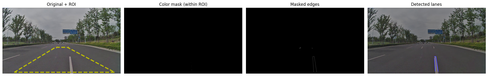

# Lane Detection Script

This repository contains a Python script that performs lane detection on an input image using computer vision techniques such as color masking, Canny edge detection, and Hough line transform. The script processes the input image to detect lanes, visualize the results, and overlay detected lanes on the original image.

## Requirements

- Python 3.x
- OpenCV (`cv2`)
- Matplotlib
- Numpy

You can install the necessary libraries using `pip`:

```bash
pip install opencv-python matplotlib numpy
```
## Usage
### 1. Input Image
The script assumes that the input image is a road scene stored as road1.jpg in the same directory as the script. Modify the image = mpimg.imread('road1.jpg') line to change the image source if necessary.

### 2. Tunable Parameters
The script has several tunable parameters that you can adjust depending on your image and lane conditions:

Color Thresholds (RGB): Adjust these to filter out bright lane-like pixels.

RED_T, GREEN_T, BLUE_T: These control the color threshold for the bright lane pixels.

Canny Edge Detection: Adjust LOW_T and HIGH_T for more or less sensitivity to edges.

Gaussian Blur Kernel Size: GAUSS_KSIZE controls the blurring of the image.

Hough Transform Parameters:

RHO, THETA, HOUGH_THRESH: These control the sensitivity and precision of the Hough line detection.

MIN_LINE_LEN, MAX_LINE_GAP: These parameters control the minimum length of detected lines and the maximum gap allowed between line segments.

### 3. Region of Interest (ROI)
The region of interest is defined as a polygon (trapezoid) where lane detection will focus. This is specified by the ROI parameter, where each point is defined as a fraction of the image width and height.

### 4. Output
The script processes the input image by:

Applying a color mask to isolate bright lane-like pixels.

Creating a region of interest (ROI) mask.

Converting the image to grayscale and applying Gaussian blur and Canny edge detection.

Using the Hough Line Transform to detect lane lines in the masked image.

Overlaying the detected lane lines on the original image.

Displaying debug panels showing intermediate results such as the color mask, edges, and the final lane-detection overlay.


### 5. Visual Debugging
The script visualizes the following debug panels:

Original Image + ROI: Shows the original image with the region of interest (ROI) highlighted.

Color Mask (within ROI): Displays the pixels in the image that match the color threshold criteria.

Masked Edges: Shows the edges detected within the ROI.

Detected Lanes: Shows the final image with detected lane lines overlaid.

### Code Structure
Tunable Parameters: Located at the top of the script.

Image Preprocessing: Color mask, ROI mask, and Canny edge detection.

Lane Detection: Hough Line Transform to detect lanes.

Visualization: Matplotlib used to visualize the debug panels and final lane detection results.
